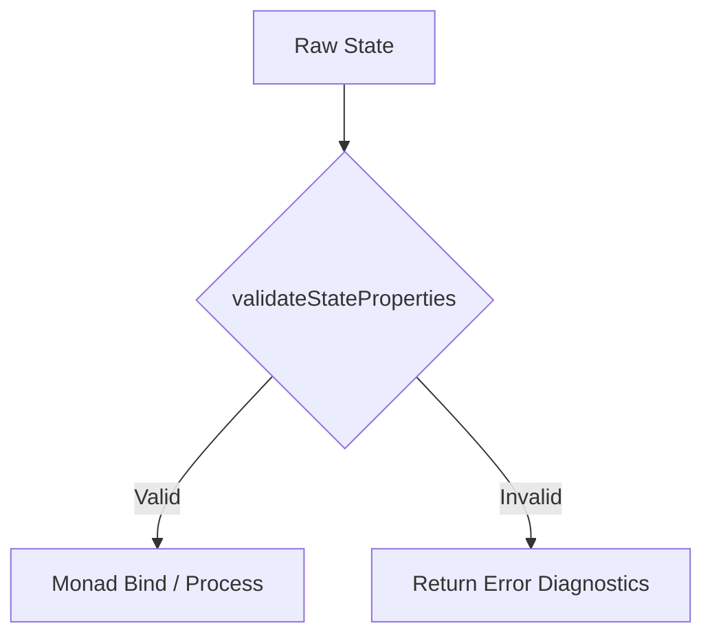

# RFC 033: Thermodynamic State Vector Property Validator Helper

## 1. Executive Summary
Sprint 033 introduces the Thermodynamic State Vector Property Validator Helper (`src/thermodynamics/state_validator.ts`). This component provides a robust, pure validation function `validateStateProperties(state)` that inspects thermodynamic state vectors to ensure the integrity, presence, and validity of required thermodynamic properties (`energy`, `entropy`, `temperature`, and `stocks`) without throwing runtime errors.

## 2. Architectural Context & Objectives
- **Module Path:** `src/thermodynamics/state_validator.ts`
- **Design Pattern:** Pure Functional Validation with non-throwing boolean/result return contracts.
- **Thermodynamic Laws Compliance:**
  - *First Law (Conservation of Energy/Matter):* Validates that total energy and stock inventories are numerically bounded and non-negative where physically required.
  - *Second Law (Entropy & Degradation):* Validates entropy bounds and non-decreasing trajectory expectations.
  - *Solar Input Only:* Ensures external boundary energy inputs align with Gaia system constraints.

## 3. Interface Contracts & Class Hierarchy
- **Input Type:** `ThermodynamicState` (imported from `src/thermodynamics/types.ts` or `state_vector.ts`).
- **Output Type:** `ValidationResult`
  ```ts
  export interface ValidationResult {
    valid: boolean;
    errors: string[];
  }
  ```
- **Core Function Signature:**
  ```ts
  export function validateStateProperties(state: any): ValidationResult;
  ```

## 4. Validation Rules
1. **Presence Checks:**
   - `energy`: must be defined and of type `number`.
   - `entropy`: must be defined and of type `number`.
   - `temperature`: must be defined and of type `number`.
   - `stocks`: must be defined, non-null, and an object/Map containing key-value stock inventories.
2. **Value Validity Checks:**
   - `energy >= 0`
   - `entropy >= 0`
   - `temperature >= 0`
   - `stocks` properties must be numeric and non-negative.

## 5. Monad Stock Transitions
State validation wraps or inspects monad state transitions to ensure computations passing through `ThermodynamicMonadProcess` maintain thermodynamic validity without failing unpredictably.


## 6. Incremental Design & Integration
- Builds upon `src/thermodynamics/state_vector.ts` and `src/thermodynamics/types.ts`.
- Integrates seamlessly with existing cycle models (Carbon, Nitrogen, Phosphorus, Water) to verify pod equilibrium states during simulation ticks.