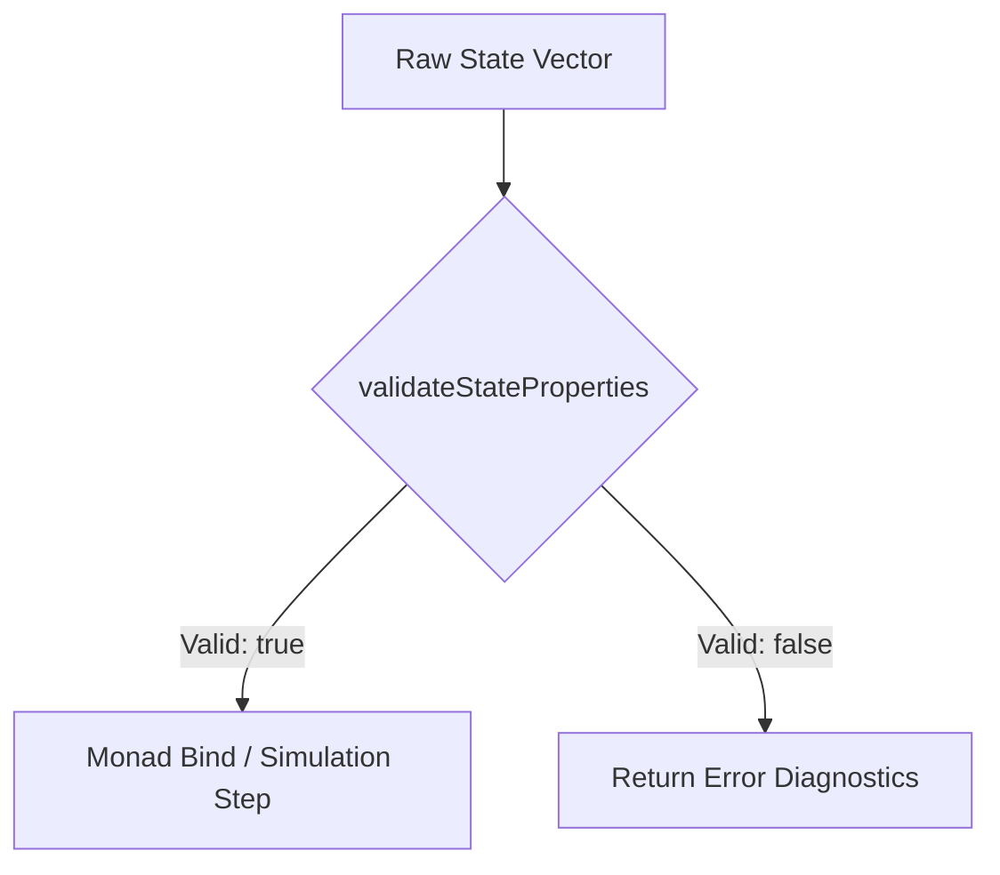

<!-- Release Notes -->
# Sprint 033 Release Notes: Thermodynamic State Vector Property Validator Helper

## Overview
Sprint 033 delivers the **Thermodynamic State Vector Property Validator Helper** (`src/thermodynamics/state_validator.ts`). This release introduces a pure validation function, `validateStateProperties(state)`, designed to inspect thermodynamic state vectors and verify the presence, structure, and validity of core thermodynamic properties (`energy`, `entropy`, `temperature`, and `stocks`) safely and without throwing runtime exceptions.

---

## Key Features & Modifications

### 1. Core Implementation (`src/thermodynamics/state_validator.ts`)
- **Pure Functional Validation:** Implemented `validateStateProperties(state: any): ValidationResult` adhering to strict non-throwing error handling contracts.
- **Validation Result Interface:** 
  ```ts
  export interface ValidationResult {
    valid: boolean;
    errors: string[];
  }
  ```

### 2. Validation Rules & Physical Constraints
The validator enforces rigorous consistency checks aligned with fundamental thermodynamic laws:
- **Presence Checks:** Ensures `energy`, `entropy`, `temperature`, and `stocks` are explicitly defined with correct primitive and structural types (`number` for scalar properties, non-null `object`/`Map` for inventories).
- **Value Bounds:**
  - `energy >= 0` (First Law compliance: non-negative conservation boundaries).
  - `entropy >= 0` (Second Law compliance: non-negative degradation limits).
  - `temperature >= 0` (Absolute zero boundary compliance).
  - `stocks` properties must consist of valid, non-negative numeric inventories.

### 3. Monad & Process Integration
- **Safe Pipeline Execution:** Integrates directly with `ThermodynamicMonadProcess` workflows to intercept and diagnose invalid state transitions before execution bounds are breached.
- **Diagnostic Feedback:** Returns structured error strings in the `ValidationResult` payload, enabling graceful recovery and debugging during simulation ticks across biogeochemical cycles (Carbon, Nitrogen, Phosphorus, Water).

---

## Architectural Workflow


---

## Verification & Testing
- Added comprehensive unit test suites covering edge cases, missing attributes, malformed types, and negative thermodynamic bounds.
- Verified zero-exception safety guarantees under highly stressed simulation inputs.