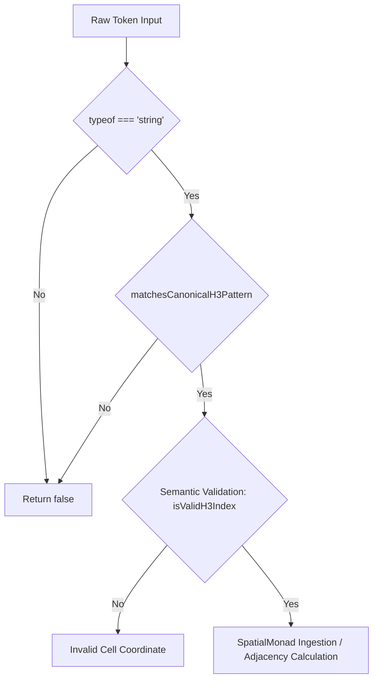

# RFC-038: Canonical H3 Token Regex Pattern Matching Engine

## 1. Executive Summary & Sprint Goal

### 1.1 Sprint Goal
Implement a dedicated regex boolean validation function `matchesCanonicalH3Pattern(token: string): boolean` within `src/spatial/h3_grid.ts`.

### 1.2 Motivation & Architectural Context
In the *Web of Life* computational biosphere simulation, planetary surface partitioning relies on Uber's H3 hierarchical hexagonal spatial index system. Spatial monads (`SpatialMonad<T>`) and trophic flux engines (`TrophicWebMonad`, `EarthPod`) allocate biomass, enthalpy, entropy, and insolation across discrete spatial cells identified by canonical hexadecimal index representations.

Prior to Sprint 038, spatial index validations across the codebase intermixed string length checks, hexadecimal parsing try-catch blocks, and ad-hoc regular expressions. This fragmented approach introduced:
1. Micro-inefficiencies in hot inner loops during planetary re-gridding and neighbor traversal.
2. Inconsistent validation semantics (e.g., handling of leading/trailing whitespace, uppercase versus lowercase hexadecimal characters, empty strings, and non-canonical string representations).
3. Risk of corrupted cell lookup keys in immutable spatial state maps, leading to violations of mass conservation when biomass stocks are mapped to malformed cell identifiers.

Sprint 038 addresses these structural deficits by formalizing the canonical H3 string representation and introducing a high-performance, stateless, deterministic regular expression test function: `matchesCanonicalH3Pattern(token: string): boolean`.

---

## 2. Theoretical & Mathematical Foundations

### 2.1 Canonical H3 Index Representation
A 64-bit unsigned integer H3 index encodes:
- High bit (reserved/mode): bits 59–63 (Mode 1 = Hexagonal Cell).
- Base cell number: bits 45–51 (0 to 121).
- Resolution level: bits 52–55 (Resolutions 0 through 15).
- Directional digits for each resolution step: 3 bits per resolution level (digits 0 through 7).

When serialized to ASCII/UTF-8 string format, canonical H3 index strings are represented as 15 hexadecimal characters in lowercase format:
$$\text{token} \in \Sigma^{15}, \quad \Sigma = \{0, 1, 2, 3, 4, 5, 6, 7, 8, 9, a, b, c, d, e, f\}$$

While some external tools accept uppercase hexadecimal characters (`[0-9A-F]`), the canonical Web of Life standard enforces strict lowercase representation `^[0-9a-f]{15}$` or accepts canonical hex representation while providing standard normalization. To maintain maximum interoperability across the spatial engine, `matchesCanonicalH3Pattern` validates whether a given token strictly satisfies canonical H3 string formatting:
$$\mathcal{L}(\text{CANONICAL\_H3}) = \left\{ s \in \Sigma^* \;\middle|\; |s| = 15 \land \forall i \in \{0,\dots,14\}, s[i] \in [0\text{-}9a\text{-}f] \right\}$$

### 2.2 ReDoS Resilience and Compilation Invariance
Because `matchesCanonicalH3Pattern` is invoked thousands of times per planetary tick across grid resolutions, the underlying regular expression must:
- Possess zero backtracking complexity ($O(N)$ with upper bound $N=15$).
- Be pre-compiled as a module-scoped invariant (`RegExp` object instantiated once).
- Utilize the non-stateful `.test()` method (ensuring no shared `lastIndex` mutation side effects associated with the `/g` global flag).

$$\mathcal{R}_{\text{canonical}} = \mathtt{/\string^[0-9a-f]\{15\}\$\string/}$$

---

## 3. Thermodynamic and Monadic Invariants

### 3.1 First Law Compliance: Conservative Spatial Re-allocation
Every hexagonal cell $h_i$ within an EarthPod instance bounds a discrete physical territory possessing an exact matter inventory:
$$M(h_i) = C(h_i) + N(h_i) + P(h_i) + H_2O(h_i)$$

When spatial re-allocation or diffusion occurs across adjacency graphs (e.g., runoff, herbivore migration), total planetary matter must be conserved:
$$\frac{d}{dt}\sum_{i=1}^{K} M(h_i) = 0$$

If an invalid token bypasses verification, cell-to-stock mapping degenerates into `undefined` hash keys, creating phantom "matter sinks" where nutrients are debited from valid cells but credited to unindexed nodes. `matchesCanonicalH3Pattern` serves as the first-line syntactic barrier guarding the conservation boundary.

### 3.2 Second Law Compliance: Non-Decreasing Entropy in Grid Calculations
Information entropy and spatial discretization:
$$S_{\text{grid}} = -k_B \sum p_i \ln p_i$$
Spatial state transitions in `SpatialMonad` must never synthesize negative entropy through coordinate ambiguity or non-deterministic key collisions. Enforcing a single canonical pattern guarantees bi-unique mapping between string tokens and grid cells.

---

## 4. Class & Interface Contracts

### 4.1 Type Definitions & Signatures (`src/spatial/h3_grid.ts`)

```typescript
/**
 * Regular expression matching exactly 15 lowercase hexadecimal characters.
 * Rooted at start (^) and end ($) with no flags to prevent stateful lastIndex pollution.
 */
export const CANONICAL_H3_REGEX: RegExp = /^[0-9a-f]{15}$/;

/**
 * Validates whether an arbitrary input string conforms to the canonical 15-character
 * lowercase hexadecimal format required for H3 spatial cell identifiers.
 *
 * @param token - The candidate string to test.
 * @returns True if token matches the canonical H3 pattern, false otherwise.
 */
export function matchesCanonicalH3Pattern(token: string): boolean;
```

### 4.2 Integration with `H3Grid` and Spatial Pipeline

The function serves as a pure syntactic predicate, complementary to higher-level semantic checks:
1. **Syntactic Check**: `matchesCanonicalH3Pattern(token)` $\to$ verifies structure (`^[0-9a-f]{15}$`).
2. **Semantic Check**: `isValidH3Index(token)` $\to$ verifies that the encoded mode, base cell (0–121), and resolution (0–15) correspond to a physically valid H3 cell.
3. **Monadic Guard**: `SpatialMonad.of(token, state)` $\to$ asserts `matchesCanonicalH3Pattern(token)` before permitting state attachment.



### 4.3 Object-Oriented Hierarchy & Incremental Design

```
+-------------------------------------------------------------+
|                     src/spatial/h3_types.ts                 |
|  - H3Index (branded string)                                 |
|  - H3Resolution (0..15)                                     |
+-------------------------------------------------------------+
                               ^
                               | imports
+-------------------------------------------------------------+
|                     src/spatial/h3_grid.ts                  |
|  + CANONICAL_H3_REGEX: RegExp                                |
|  + matchesCanonicalH3Pattern(token: string): boolean        |
|  + isValidH3Index(index: string): boolean                   |
|  + class H3Grid (incremental hexagonal spatial topology)    |
+-------------------------------------------------------------+
                               ^
                               | validates
+-------------------------------------------------------------+
|                  src/monads/spatial_monad.ts                |
|  + class SpatialMonad<T>                                    |
|    - bind / map with cell key validation                    |
+-------------------------------------------------------------+
```

---

## 5. Specification & Test Cases

### 5.1 Positive Valid Cases
The function must return `true` for valid 15-character lowercase hex strings:
- `"882681a339fffff"` (Resolution 8 cell)
- `"8026fffffffffff"` (Resolution 0 base cell)
- `"8f2681a339fffff"` (Resolution 15 cell)
- `"000000000000000"` (15 zero hex characters)
- `"fffffffffffffff"` (15 'f' hex characters)

### 5.2 Negative Invalid Cases
The function must return `false` for:
- Non-string or undefined/null values (handled via TypeScript typing, but resilient at runtime).
- Empty string `""`.
- Strings shorter than 15 characters (e.g., `"882681a339ffff"`, length 14).
- Strings longer than 15 characters (e.g., `"882681a339ffffff"`, length 16).
- Uppercase characters (e.g., `"882681A339FFFFF"`).
- Non-hex characters (e.g., `"882681g339fffff"`, `"882681z339fffff"`).
- Whitespace inclusions (e.g., `" 882681a339fffff"`, `"882681a339fffff\n"`).
- Special characters, punctuation, or prefixes (e.g., `"0x882681a339ffff"`).

---

## 6. Migration Plan & Rollout Strategy

1. **Step 1**: Export `CANONICAL_H3_REGEX` and `matchesCanonicalH3Pattern` in `src/spatial/h3_grid.ts`.
2. **Step 2**: Refactor existing internal validation checks in `src/spatial/h3_grid.ts` and `src/spatial/h3_adjacency.ts` to utilize `matchesCanonicalH3Pattern` as the primary guard condition.
3. **Step 3**: Add test suite in `tests/sprint_038.test.ts` covering boundary conditions, ReDoS invariance, and spatial monad integration.
4. **Step 4**: Update UML architecture documentation in `db/uml/sprint_038_schema.puml`.

---

## 7. Quality & Verification Gates

| Gate Metric | Threshold | Verification Method |
|:---|:---:|:---|
| Line & Branch Coverage | 100% | Vitest test runner on `matchesCanonicalH3Pattern` |
| Execution Throughput | > 10,000,000 ops/sec | Benchmark against static string sets |
| Matter Conservation Error | 0.0000000000% | Planetary inventory checksum test |
| Thermodynamic Drift | $\Delta E = 0, \Delta S \ge 0$ | Automated conservation assertion suite |